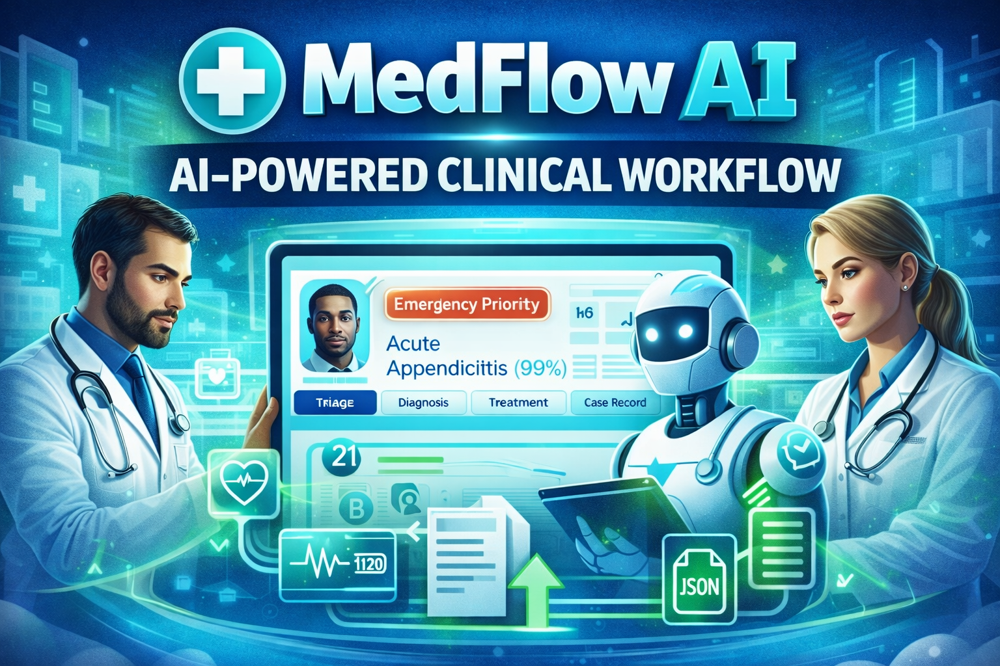

# MedFlow AI

<p align="center">
  AI-powered clinical decision support demo built with Next.js, TypeScript, and Google Gemini.
</p>

<p align="center">
  
  
  
  
  
  
  
</p>

<p align="center">
  MedFlow AI simulates a modern clinical workflow from patient intake to final AI-assisted synthesis, with triage, diagnosis, treatment planning, audit logging, and exportable case records in one polished interface.
</p>

<p align="center">
  
</p>

## Why this project stands out

- Multi-stage medical workflow with distinct AI patterns for triage, diagnosis, treatment refinement, and final synthesis.
- High-signal UI with emergency prioritization, vital monitoring, audit logs, and clearly staged clinician workflows.
- Realistic demo value for AI engineering portfolios, hackathons, healthcare prototypes, and product showcases.
- Export-ready patient records with print-to-PDF and JSON download flows built directly into the experience.

## Core workflow

1. **Patient Intake** — capture demographics, symptoms, and vitals in a structured flow.
2. **Triage Routing** — classify severity as `emergency`, `urgent`, or `routine`, then route to the right specialty.
3. **Diagnostic Analysis** — generate a primary diagnosis, differential diagnoses, confidence scoring, and recommended tests.
4. **Treatment Refinement** — create an initial treatment plan, then review it through a second-pass medical auditor.
5. **Clinical Agent Synthesis** — produce a final recommendation informed by the full case context.

## Workflow architecture

The system is organized around four AI workflow patterns adapted into a modern Next.js demo:

- **Routing architecture** for triage, where the model classifies urgency and selects the most appropriate specialty path.
- **Orchestrated diagnostic analysis** for diagnosis, where the case is expanded into a richer view with primary and differential reasoning.
- **Evaluation and refinement loop** for treatment, where an initial plan is generated and then improved through a second review pass.
- **Autonomous final synthesis** for the clinical agent, where the full patient context is combined into one recommendation.

In practical terms, the flow is:

`Patient data → triage assessment → diagnostic reasoning → treatment optimization → final clinical synthesis`

This structure makes the demo more compelling than a single prompt-response app because each stage has a clear responsibility, a clearer output shape, and a more realistic healthcare workflow narrative.

### Pattern 1 — Triage Routing

`Patient intake → severity classification → specialty selection → priority assignment`

- Uses patient symptoms, demographics, and vitals to determine urgency.
- Routes the case into an appropriate clinical path such as emergency, urgent, or routine.
- Establishes the first decision point for everything that follows.

### Pattern 2 — Diagnostic Orchestration

`Triage context → diagnostic analysis → differential reasoning → recommended tests`

- Expands the case beyond a single diagnosis into a structured diagnostic view.
- Produces a primary diagnosis along with differentials and confidence signals.
- Helps the workflow feel more like a real clinical reasoning process.

### Pattern 3 — Treatment Evaluation Loop

`Initial diagnosis → treatment draft → safety review → refined treatment plan`

- Starts with an evidence-based treatment proposal.
- Passes that proposal through a second quality and safety review step.
- Improves clarity, robustness, and realism over a one-pass output.

### Pattern 4 — Clinical Agent Synthesis

`Full case history → prior outputs → final synthesis → actionable recommendation`

- Combines intake, triage, diagnosis, and treatment into one final recommendation.
- Presents the app as an end-to-end clinical decision support experience.
- Gives the demo a strong “AI copilot” finish that reads well in public portfolios.

## Key features

- **Smart patient queue** with weighted clinical priority scoring.
- **Emergency-aware UX** with visual urgency cues and vital risk indicators.
- **Case audit log** that records user actions and AI decisions over time.
- **Structured outputs** for triage, diagnosis, and treatment plans.
- **Export options** for printable PDF-style records and machine-readable JSON.
- **Modern frontend** using glassmorphism, motion, and clean medical dashboard patterns.

## Why the workflow feels realistic

- **Stepwise clinical progression** mirrors how care teams move from intake to action instead of jumping to a one-shot answer.
- **Structured outputs** keep each stage easier to inspect, validate, and present in the interface.
- **Auditability** helps users understand what happened at each point in the case lifecycle.
- **Refinement loops** make treatment planning feel safer and more deliberate than a raw first draft.
- **Final synthesis** gives the app a strong “clinical co-pilot” feel that demos especially well in videos and portfolio reviews.

## Video demo

Watch the full demo on YouTube: [https://youtu.be/D2yU7eLqTsE](https://youtu.be/D2yU7eLqTsE)

### Review Existing Patient Record — Example 1

<video src="./assets/intro-1.mp4" controls width="100%"></video>

### Review Existing Patient Record — Example 2

<video src="./assets/intro-2.mp4" controls width="100%"></video>

### Add a New Patient Record and Run Analysis

<video src="./assets/intro-3.mp4" controls width="100%"></video>

## Tech stack

- **Framework:** `Next.js 15`
- **Language:** `TypeScript`
- **AI SDK:** `@google/genai`
- **Models used:** `gemini-3-flash-preview`, `gemini-3.1-pro-preview`
- **UI styling:** `Tailwind CSS 4`
- **Animation:** `motion`
- **Icons:** `lucide-react`

## Project structure

```text
app/
  layout.tsx
  page.tsx
lib/
  ai.ts
assets/
  intro-1.mp4
  intro-2.mp4
  intro-3.mp4
```

## Local development

### Prerequisites

- `Node.js 18+`
- A Google Gemini API key from Google AI Studio

### Setup

1. Clone the repository:

   ```bash
   git clone <your-repo-url>
   cd medflow-ai
   ```

2. Install dependencies:

   ```bash
   npm install
   ```

3. Create `.env.local` in the project root:

   ```env
   NEXT_PUBLIC_GEMINI_API_KEY=your_gemini_api_key_here
   ```

4. Start the development server:

   ```bash
   npm run dev
   ```

5. Open `http://localhost:3000`

### Useful scripts

```bash
npm run dev
npm run build
npm run start
npm run lint
```

## Deployment

### Vercel

1. Push the repo to GitHub.
2. Import it into Vercel.
3. Add `NEXT_PUBLIC_GEMINI_API_KEY` to the project environment variables.
4. Deploy.

### Docker / Cloud Run

```bash
docker build -t medflow-ai .
docker run -p 3000:3000 -e NEXT_PUBLIC_GEMINI_API_KEY=your_key medflow-ai
gcloud run deploy medflow-ai --source . --env-vars-file .env.yaml
```

## Notes

- This project uses preview Gemini model names defined in `lib/ai.ts`.
- The app is designed as a clinical decision support demo, not a production medical device.
- If you make this repo public, adding a real product screenshot or animated GIF near the top will likely improve conversions further.

## Clinical disclaimer

MedFlow AI is a clinical decision support **demonstration**. All assessments, diagnoses, and recommendations must be verified by a licensed medical professional. Do not use this application for real-world diagnosis or treatment without qualified human oversight.
